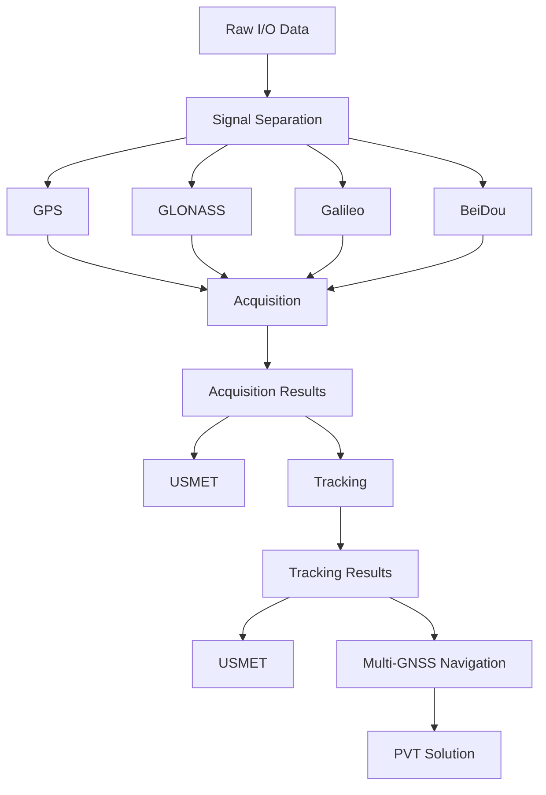
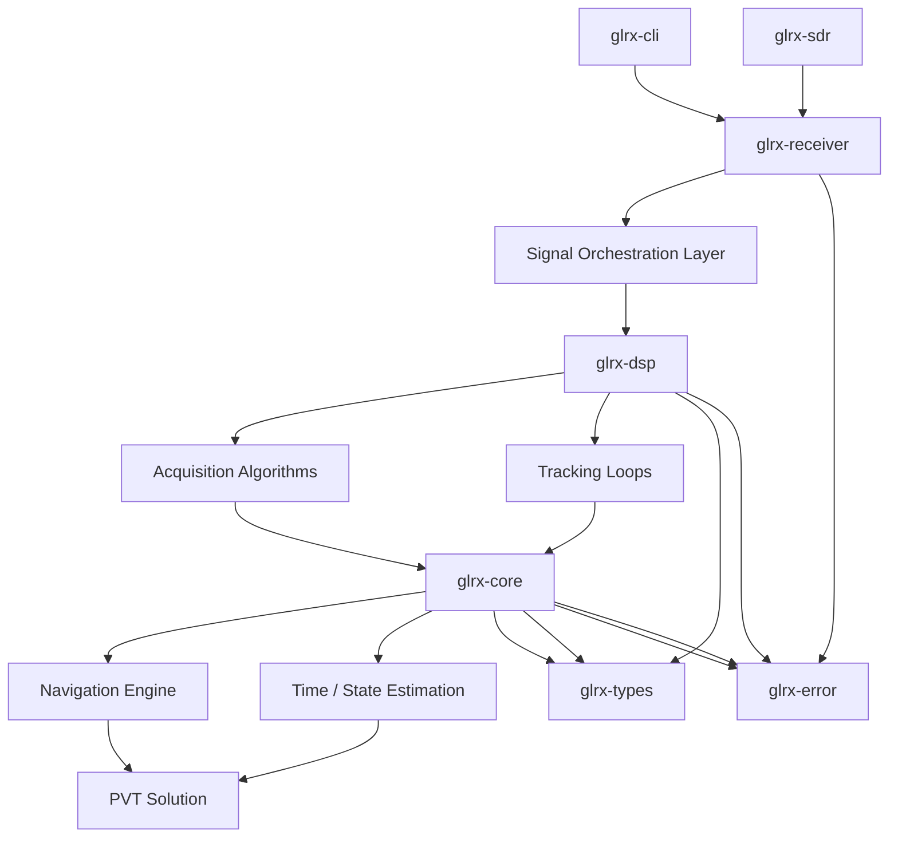

# GLRX — GNSS Layered Receiver

[](https://github.com/MiCkEyZzZ/glrx/actions)
[](https://www.rust-lang.org/)

**GLRX** is a modular GNSS SDR receiver implemented in Rust, focused on
layered DSP pipelines, satellite tracking, navigation message decoding,
and precise positioning.

## Architecture

The diagram below represents the current processing flow implemented in
GLRX.



## Planned Workspace Architecture

As GLRX evolves, the project is planned to transition into a layered
multi-crate workspace. This architecture separates hardware interfaces,
DSP algorithms, navigation logic, shared types, and user-facing
applications while keeping each component independently testable.



## Features

- Read I/Q data from files or SDR devices.
- FFT-based satellite acquisition.
- DLL, PLL and FLL tracking loops.
- Navigation message decoding.
- GPS ephemeris decoding.
- Multi-GNSS navigation pipeline.
- Pseudorange computation.
- Position estimation (Least Squares / Kalman).
- Multi-channel receiver architecture.
- Export to NMEA / UBX.
- Integration with **USMET**, **GLINT**, and **GLOS**.
- Extensive unit tests, benchmarks and documentation.

## Quick Start

### Requirements

- Rust (stable toolchain)
- Optional SDR hardware:
  - SoapySDR
  - RTL-SDR
  - HackRF

### Build

```bash
cargo build --workspace --release
```

### Run tests

```bash
cargo test --workspace
```

### Run (simulator)

```bash
cargo run --release --bin glrx -- \
  --device sim \
  --freq 1602MHz \
  --rate 2MHz \
  --gain 40 \
  --duration 5
```

## Development Roadmap

- DSP primitives
- Satellite acquisition
- Tracking loops
- Navigation message decoding
- Ephemeris decoding
- Pseudorange computation
- PVT solver
- Multi-GNSS support
- NMEA / UBX output
- SDR device integration
- Workspace modularization
- Performance optimization
- Observability and validation

## Goals

GLRX aims to provide a modern, modular GNSS SDR receiver written entirely
in Rust with a strong emphasis on correctness, maintainability,
reproducibility, and extensibility.

The long-term objective is to build a reusable ecosystem of crates for
GNSS signal processing, navigation, and positioning that can be used in
both research and production environments.

## License

This project is licensed under either of

- [Apache License, Version 2.0](LICENSE.APACHE)
- [MIT License](LICENSE.MIT)
