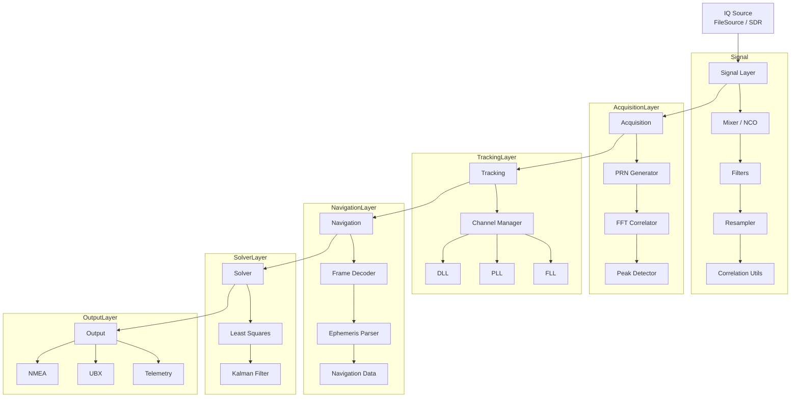

# GLRX — GNSS Receiver


**GLRX** is a modular GNSS receiver written in Rust, designed for research and
engineering experiments with satellite navigation signals such as GLONASS, GPS,
and other GNSS constellations.

The project focuses on reproducibility, modular DSP pipelines, and integration
with external telemetry and analysis tools.

## GLRX – GNSS Receiver Pipeline Overview



## Features

- Read IQ data from files or SDR devices.
- Basic signal processing primitives: mixing, filtering, resampling.
- Satellite acquisition using FFT-based search.
- Tracking loops: DLL, PLL, FLL.
- Navigation message and ephemeris decoding.
- Pseudorange computation and position estimation (Least Squares, Kalman filtering).
- Multi-channel satellite tracking.
- Output in standard formats (NMEA / UBX).
- Integration with external tools: **GLOS**, **GLINT**, **USMET**.
- Built-in support for testing, benchmarking, and observability.

## Quick Start

### Requirements

- Rust (stable toolchain)
- Optional SDR hardware:
  - SoapySDR
  - RTL-SDR
  - HackRF

### Build

```bash
cargo build --workspace --release
```

### Run tests

```bash
cargo test --workspace
```

### Run (simulator mode)

```bash
cargo run --release --bin glrx -- \
  --device sim \
  --freq 1602MHz \
  --rate 2MHz \
  --gain 40 \
  --duration 5
```

## Development Roadmap

1. IQ reader and DSP primitives
2. FFT-based satellite acquisition
3. Tracking loops (DLL / PLL / FLL) and multi-channel tracking
4. Navigation message and ephemeris decoding
5. Pseudorange computation and position solver
6. NMEA / UBX output and integration with GLINT / USMET
7. High-level processing pipeline and time synchronization
8. Performance optimization (SIMD, latency)
9. Observability, testing, and validation

## Goals

- Build a modular GNSS receiver implemented entirely in Rust.
- Ensure experiment reproducibility and system extensibility.
- Enable seamless integration with telemetry analysis and storage systems.

## License

This project is licensed under either of

- [Apache License, Version 2.0](LICENSE.APACHE)
- [MIT License](LICENSE.MIT)
