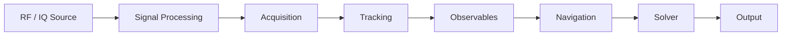

# Архитектура GLRX

В этом документе описывается внутренняя архитектура **GLRX**, модульного
GNSS-приемника, реализованного на языке Rust.

Цель архитектуры — обеспечить:

- Воспроизводимый конвейер обработки цифровых сигналов
- Модульные компоненты обработки сигналов
- Поддержка экспериментов с алгоритмами GNSS
- Четкое разделение между обработкой сигналов и навигационной логикой
- Интеграция с внешними инструментами телеметрии и анализа

## 1. Обзор системы

GLRX организован как **конвейер обработки сигналов**.

Конвейер обработки данных обрабатывает необработанные IQ-сэмплы от
радиочастотного источника и выдает навигационные решения и телеметрические
данные.

Этапы конвейера:



Каждый этап реализован как независимый модуль с четко определенными интерфейсами.

Такая конструкция позволяет разрабатывать, тестировать и заменять компоненты независимо
друг от друга.

## 2. Высокоуровневый конвейер

```text

RF / IQ Source
↓
Signal Layer (DSP primitives)
↓
Acquisition (satellite search)
↓
Tracking (DLL / PLL / FLL loops)
↓
Navigation (frame decoding and ephemeris)
↓
Observables (pseudorange, Doppler, CN0)
↓
Position Solver
↓
Output (NMEA / UBX / Telemetry)

```

## 3. RF(Радиочастотный) уровень

Модуль:

```text
src/rf/
```

Обязанности:

- Обеспечить единый интерфейс для источников данных IQ
- Поддерживать устройства SDR и воспроизведение файлов
- Обеспечить поддержку потоковой передачи и буферизации
- Нормализовать форматы сэмплов

Ключевая абстракция:

```rust
trait IqSource {
    fn read(&mut self, buffer: &mut [Complex<f32>]) -> Result<usize>;
}
```

Источники информации:

| Источник   | Описание                                                 |
| ---------- | -------------------------------------------------------- |
| FileSource | Воспроизведение записанных файлов IQ                     |
| SdrSource  | Ввод SDR-сигнала в реальном времени (SoapySDR / RTL-SDR) |

Вспомогательные компоненты:

- Преобразование формата сэмплов
- Потоковая передача через кольцевой буфер
- Обнаружение пропущенных сэмплов
- Сбор метрик RF(радиочастотного диапазона)

## 4. Уровень обработки сигналов

Модуль:

```text
src/signal/
```

Этот слой предоставляет **примитивы цифровой обработки сигналов**, используемые
на приемнике.

Примеры:

| Компонент             | Цель                                |
| --------------------- | ----------------------------------- |
| Mixer / NCO           | Частотный перевод                   |
| FIR Filter            | Управление полосой пропускания      |
| Resampler             | Корректировка частоты дискретизации |
| FFT utilities         | Алгоритмы сбора данных              |
| Correlation utilities | Слежение за петлями                 |

Эти примитивы намеренно **низкоуровневые и многоразовые**.

## 5. Уровень сбора данных

Модуль:

```text
src/acquisition/
```

В процессе захвата сигнала выполняется **обнаружение спутников** путём поиска PRN-кодов
во входящем сигнале.

Задачи:

- генерировать PRN-коды
- выполнять поиск по фазам кода
- оценивать доплеровскую частоту
- обнаруживать пики корреляции

Основной алгоритм:

**Параллельный поиск фаз кода на основе БПФ (PCPS)**

Выход:

```text
AcquisitionResult {
  prn: u8,
  doppler_hz: f32,
  code_phase: usize
}
```

Этот результат инициализирует **канал отслеживания**.
