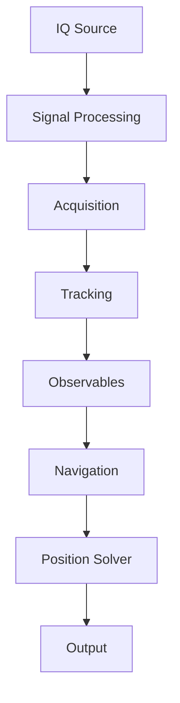

# Конвейер приема

GLRX обрабатывает сигналы через многоступенчатый конвейер.

```mermaid
flowchart TD

A[IQ Source] --> B[Signal Processing]
B --> C[Acquisition]
C --> D[Tracking]
D --> E[Observables]
E --> F[Navigation]
F --> G[Position Solver]
G --> H[Output]
```

На каждом этапе данные преобразуются в абстракции более высокого уровня.
